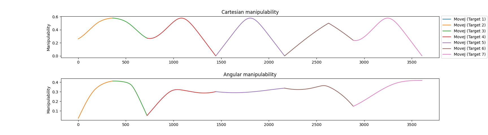

# RoboDK Tools

A collection of python programs for RoboDK

**WARNING**
Robots can be DANGEROUS. Use the code here at your own risk. Please take precautions when working with real robots.

## singularity analysis

Gets the robot joint trajectories from robodk and evaluates each step to calculate the manipulability using the jacobian matrix.

```
usage: singularity_analysis.py [-h] [--program-name PROGRAM_NAME]

This module provides functions to evaluate the manipulability of a RoboDK program.
It calculates the manipulability of each move instruction in the program and plots the results.
If the robot approaches a joint singularity, the manipulability score will approach zero.

options:
  -h, --help            show this help message and exit
  --program-name PROGRAM_NAME
                        Name of the program to evaluate. You will be asked to pick a program if not specified.
```
**Sample result:**


## Path Planning

Implementation of PRM and RRT algorithms for path planning using RoboDK

RoboDK already allows you to create PRM maps, but you cannot save/load different maps for your station. This implementation allows for saving the collision free map.

The RRT implementation also allows for quickly generating collision free trajectories when creating a PRM map would not be practical.

the `pathplanning_example.ipynb` notebook explains how to use these modules.
